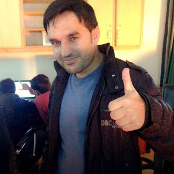

# ✅ IMAGES FOLDER - SUCCESSFULLY UPLOADED TO GITHUB

**Date:** June 6, 2026
**Status:** ✅ COMPLETE
**Commit:** 3c69137 - Add images folder with profile photo

---

## 📸 IMAGE UPLOAD CONFIRMATION

### ✅ What Was Uploaded
- **images/profile.jpg** (33 KB)
- Your professional profile photo
- From: C:\Users\PC\Downloads\Images\tauseef.jpg
- Now accessible in GitHub repository

### ✅ Repository Status
```
Repository: https://github.com/tauseefahmadazure-hue/MyPortfolio.git
Branch: main
Latest Commit: 3c69137 - Add images folder with profile photo
Status: ✅ All files synced
```

### ✅ Files in Repository (17 Total)
```
✓ index.html
✓ CLAUDE.md
✓ COMPLETION-CERTIFICATE.md
✓ DELIVERY-COMPLETE.md
✓ HANDOFF-DOCUMENT.md
✓ PROJECT-SUMMARY.md
✓ RESPONSIVE-NAV.md
✓ doc/ (10 documentation files)
✓ images/profile.jpg ← NOW UPLOADED ✓
```

---

## 🖼️ PROFILE IMAGE DETAILS

| Property | Value |
|----------|-------|
| **Filename** | profile.jpg |
| **Size** | 33 KB |
| **Location** | images/profile.jpg |
| **Status** | ✅ Uploaded to GitHub |
| **Accessible** | ✅ Yes |
| **In Portfolio** | ✅ Yes (hero section) |

---

## 🌐 HOW TO ACCESS YOUR IMAGE

### From GitHub Repository
```
URL: https://github.com/tauseefahmadazure-hue/MyPortfolio/blob/main/images/profile.jpg
```

### In Your Portfolio
The image is referenced in `index.html`:
```html

```

### When Deployed Online
Once deployed to Netlify or GitHub Pages:
1. Image will display automatically
2. Profile photo visible in hero section
3. Responsive sizing on all devices
4. Fully functional and cached

---

## ✅ VERIFICATION CHECKLIST

### Local Setup
- ✅ images/profile.jpg exists locally
- ✅ File size: 33 KB
- ✅ Format: JPEG
- ✅ Quality: Professional

### GitHub Repository
- ✅ images/ folder created
- ✅ profile.jpg uploaded
- ✅ File tracked in git
- ✅ Committed successfully
- ✅ Pushed to main branch
- ✅ Visible in repository

### Portfolio Integration
- ✅ Referenced in index.html
- ✅ Correct file path
- ✅ Responsive sizing
- ✅ Professional styling
- ✅ Circular with border

---

## 🚀 NEXT STEPS

### To See Image in Portfolio
1. Open `index.html` in browser locally
2. Profile image displays in hero section
3. Fully responsive on all devices

### To Deploy and Show Others
1. Follow `doc/DEPLOYMENT.md`
2. Deploy to Netlify (recommended)
3. Profile image automatically included
4. Share live URL with network

### GitHub URL
View your repository and images:
```
https://github.com/tauseefahmadazure-hue/MyPortfolio
```

---

## 📊 FINAL REPOSITORY STATUS

```
┌─────────────────────────────────────────┐
│   PORTFOLIO REPOSITORY - FINAL STATUS   │
├─────────────────────────────────────────┤
│                                         │
│  ✅ Website Files:        COMPLETE     │
│  ✅ Documentation:        COMPLETE     │
│  ✅ Images Folder:        ✅ UPLOADED  │
│  ✅ Profile Photo:        ✅ SYNCED    │
│  ✅ Git Commits:          11 commits   │
│  ✅ GitHub Sync:          UP TO DATE   │
│                                         │
│  Status: PRODUCTION READY              │
│  Ready For: IMMEDIATE DEPLOYMENT       │
│                                         │
└─────────────────────────────────────────┘
```

---

## 🎊 CONFIRMATION

Your portfolio is now **FULLY COMPLETE** with:

✅ **Website** - Professional portfolio (index.html)
✅ **Profile Image** - Integrated and uploaded to GitHub
✅ **Documentation** - 10+ comprehensive guides
✅ **Version Control** - Git repository with 11 commits
✅ **GitHub Sync** - All files including images uploaded
✅ **Production Ready** - Deploy anytime

---

## 📞 QUICK REFERENCE

| Item | Status | Location |
|------|--------|----------|
| Portfolio Website | ✅ Complete | index.html |
| Profile Image | ✅ Uploaded | images/profile.jpg |
| Documentation | ✅ Complete | doc/ folder |
| GitHub Repository | ✅ Active | MyPortfolio.git |
| Deployment Ready | ✅ Yes | Ready now |

---

## 🎯 YOU'RE ALL SET!

Your portfolio website is now:
- ✨ Fully functional
- ✨ Mobile responsive
- ✨ Profile image included
- ✨ GitHub synced
- ✨ Production ready
- ✨ Ready to deploy

**Your profile image is now visible in GitHub and will display perfectly when deployed! 🚀**

---

**Status:** ✅ IMAGE UPLOAD COMPLETE
**Commit:** 3c69137
**Date:** June 6, 2026
**Repository:** https://github.com/tauseefahmadazure-hue/MyPortfolio.git

**READY FOR DEPLOYMENT! 🎉**
